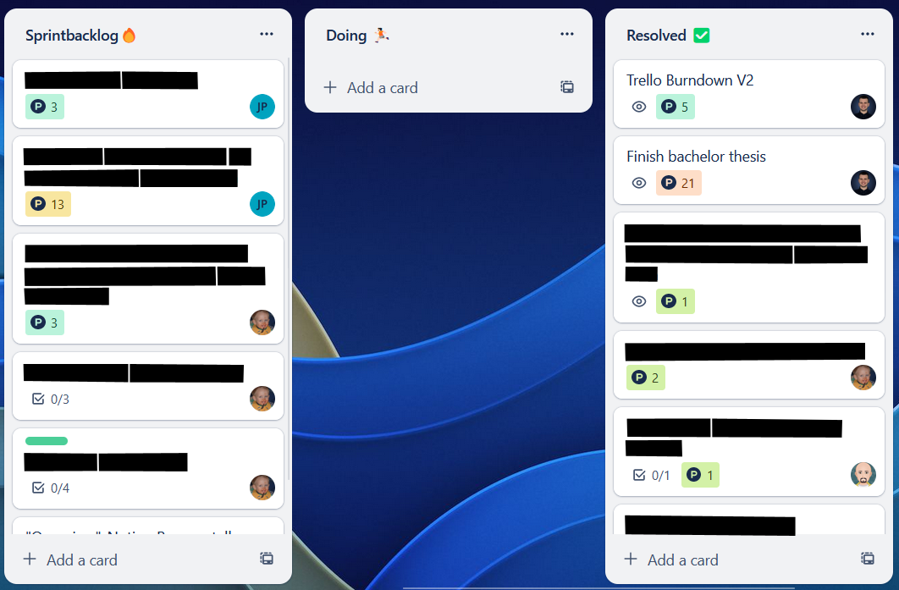

# Trello Burndown Generator

A Python CLI tool to generate a burn down chart from a Trello board using selenium and matplotlib. Optionally a burn down chart can be created for an individual member of the board such as in the example below.

Go from this:



To this:


## Usage

1. Create a Kanban Trello board with a *resolved* and a *sprint backlog* bucket.
2. Create a burner Trello account and invite them to your board (you can use your personal account, but it isn't recommended since this program requires the actual account password to login + it may also potentially ban your account for botting, although not confirmed)
3. Clone this repository and install the dependencies with

```shell
   pip install -r requirements.txt
   ```

1. Add a `conf.json` to the root dir. See [`example.conf.json`](./example.conf.json) for an example or the [*Configuration*](#configuration) section for more information.
2. Run the program in the CLI with:

```shell
py burndown_gen.py
```

## Configuration

The program can either be configured via a `conf.json` file in the root directory or via CLI arguments. The CLI arguments take precedence over the `conf.json` file. A detailed description of the configuration options can be found below.

| Option               | CLI Argument                     | Description                                                                                                      | Type                    | Default                          | Required                                             |
| -------------------- | -------------------------------- | ---------------------------------------------------------------------------------------------------------------- | ----------------------- | -------------------------------- | ---------------------------------------------------- |
| -                    | `--config` or `-c`               | The path to the config file. (only available in CLI)                                                             | `string`                | conf.json                        | Only required if not using default config file path. |
| `browser`            | `--browser` or `-b`              | The browser to use for the selenium webdriver.                                                                   | `firefox` \| `chrome`   | chrome                           | ✔️                                                    |
| `headless`           | `--headless` or `-h`             | Whether to run the browser in headless mode.                                                                     | `boolean`               | true                             | ✔️                                                    |
| `refetch`            | `--refetch` or `-r`              | Whether to refetch the data from Trello or use cached data. (will automatically refetch if cache does not exist) | `boolean`               | false                            | ✖️                                                    |
| `email`              | `--email` or `-em`               | The email of the burner Trello account.                                                                          | `string`                | -                                | ✔️                                                    |
| `password`           | `--password` or `-p`             | The password of the burner Trello account.                                                                       | `string`                | -                                | ✔️                                                    |
| `board_url`          | `--board-url` or `-burl`         | The URL of the Trello board to parse.                                                                            | `string`                | -                                | ✔️                                                    |
| `member`             | `--member` or `-m`               | The name of the burner Trello account.                                                                           | `string`                | -                                | ✖️                                                    |
| `resolved_list_name` | `--resolved-list-name` or `-rln` | The name of the resolved list.                                                                                   | `string`                | -                                | ✔️                                                    |
| `sprint_bl_name`     | `--sprint-bl-name` or `-sbln`    | The name of the sprint backlog list.                                                                             | `string`                | -                                | ✔️                                                    |
| `sprint_end_date`    | `--sprint-end-date` or `-sed`    | The end date of the sprint.                                                                                      | `YYYY-MM-DD` (`string`) | The day of execution i. e. today | ✖️                                                    |
| `sprint_duration`    | `--sprint-duration` or `-sd`     | The duration of the sprint in days.                                                                              | `int`                   | 14                               | ✖️                                                    |

## Development

To develop this program, apart from the steps mentioned above, it is recommended to create a virtual environment and install the dependencies with `pip install -r requirements.txt`.

To create a virtual environment, run `<python installation> -m venv <path to venv>`. To activate the virtual environment, run `<path to venv>/Scripts/activate.bat` on Windows or `<path to venv>/bin/activate` on Linux. To deactivate the virtual environment, run `deactivate`.

## License

See the [LICENSE](LICENSE) file.
